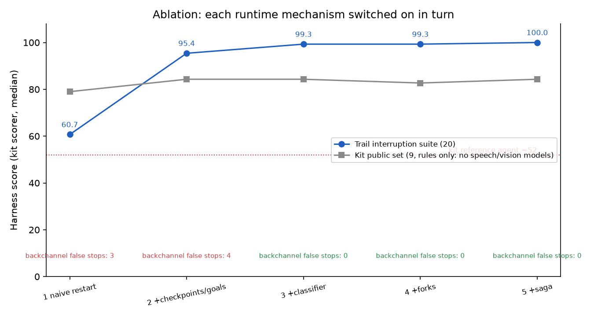
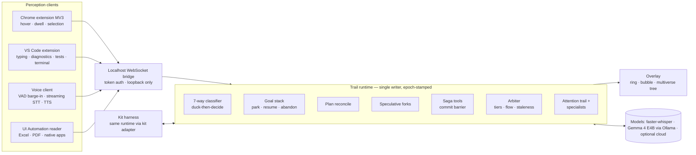

# Trail — an interruptible cursor agent

> Most assistants make you wait your turn. **Trail expects to be interrupted.**

Trail is our entry for **Samsung PRISM GenAI Hackathon 2026, Theme 05 (Interruptible Agents)**. It works across
Chrome, VS Code and your other apps. It remembers what you looked at, and it handles interruptions in both directions:

* **You interrupt Trail.** Cut it off, correct it ("actually, two passengers"), change topic, say "mm-hm", or move the
  pointer to a cheaper fare mid-sentence. Trail classifies each interruption first, then keeps, revises, parks or
  cancels exactly the work that is affected.
* **Trail interrupts you, politely.** Its own warnings wait for a pause in your typing and are dropped if you already
  fixed the problem. A pasted API key interrupts at once.

| | |
| --- | --- |
| 🎬 **Demo video** | **[youtu.be/UeZS373sl90](https://youtu.be/UeZS373sl90)** (under 5 min) · backup recording in the repo: [`docs/demo/trail_demo.mp4`](docs/demo/trail_demo.mp4) |
| 📊 **Presentation** | [`an interruptible cursor agent.pptx`](an%20interruptible%20cursor%20agent.pptx) (repo root) |
| 🏷️ **Release tag** | [`PRISM_GENAI_HACKATHON_Y2026`](../../tree/PRISM_GENAI_HACKATHON_Y2026) |
| 🧭 **Engineering log** | [`HANDOFF.md`](HANDOFF.md): status, decisions, verification and the full change log |

### Submission checklist

| Item | Status | Where |
| --- | --- | --- |
| Working prototype code in a public GitHub repo | ✅ | this repository, tag `PRISM_GENAI_HACKATHON_Y2026` |
| README with reproducible setup instructions | ✅ | [Quick start](#quick-start-run-it-in-10-minutes) and §6–§8 below |
| Demo video, max 5 minutes (YouTube) | ✅ | [youtu.be/UeZS373sl90](https://youtu.be/UeZS373sl90) |
| Presentation file (PPT) | ✅ | [`an interruptible cursor agent.pptx`](an%20interruptible%20cursor%20agent.pptx) |
| `requirements.txt` | ✅ | [`requirements.txt`](requirements.txt) |

---

## Quick start: run it in 10 minutes

These steps use Windows PowerShell, where Trail was built and tested. On macOS or Linux, use `.venv/bin/python` instead of
`.venv\Scripts\python`. The voice output and the Excel/PDF reader are Windows-only; everything else works.

**Step 1: Check the prerequisites.** You need Python 3.10–3.12 and Git.
```powershell
python --version        # expect Python 3.10.x, 3.11.x or 3.12.x
git --version
```

**Step 2: Clone and install.**
```powershell
git clone https://github.com/ShresthSamyak/cursor_agent.git
cd cursor_agent
python -m venv .venv
.venv\Scripts\python -m pip install -r requirements.txt
.venv\Scripts\python -m pip install --only-binary=:all: "av==14.2.0"   # the audio decoder faster-whisper needs
$env:PYTHONIOENCODING = "utf-8"                                         # set once per terminal
```

**Step 3 (optional): Turn on the vision model.** Install [Ollama](https://ollama.com), then:
```powershell
ollama pull gemma4:e4b-it-qat   # about 6 GB; check `ollama ps` shows "100% GPU" once it has run
```
You can skip this step. Everything still runs; only the camera-frame scenario (`pub_07`) then asks a clarifying question
instead of answering. Speech-to-text works either way, because faster-whisper downloads its model automatically on first use.

**Step 4: Run the tests.**
```powershell
.venv\Scripts\python -m pytest -q
# expect: 127 passed
```

**Step 5: Get the official score.** This is the hackathon's own evaluator: validation, a smoke test, 3 repetitions, median and weighting.
```powershell
.venv\Scripts\python eval_submission.py . --reps 3
# expect: WEIGHTED SCORE: 100.0 with Ollama running (step 3); without it, pub_07 alone drops
```

**Step 6: Watch the demo in the terminal.** This plays Acts 1–3 through the real runtime and needs no browser or microphone.
```powershell
.venv\Scripts\python -m trail demo all
.venv\Scripts\python -m trail demo heckler     # Trail 100 vs the naive agent 54.5
```

**Step 7: Watch the demo live, with the overlay.** Use two terminals.
```powershell
# Terminal 1: start the bridge (it prints the URLs and where the models are loaded)
.venv\Scripts\python -m trail bridge --dev
```
Open these two pages in your browser:
- the overlay: **http://127.0.0.1:8765/overlay/?token=trail-dev**
- the demo flights page: **http://127.0.0.1:8765/demo/flights**
```powershell
# Terminal 2: drive the acts into the live bridge; watch the overlay's bubble, fork tree and latency counters
$env:PYTHONIOENCODING = "utf-8"
.venv\Scripts\python -m trail demo all --via-bridge
```

**Step 8 (optional): Use it for real.** Point at things yourself instead of scripting them:
- the Chrome extension: *Load unpacked* → `extensions/chrome/`
- the VS Code code mentor: press F5 in `extensions/vscode/`
- the always-on-top overlay: `overlay/electron`
- the voice client: `python -m trail speech --wake`

§8 walks through each one.

---

## Contents

1. [Results](#1-results)
2. [The demo](#2-the-demo)
3. [How it works](#3-how-it-works)
4. [Architecture](#4-architecture)
5. [Models and tech stack](#5-models-and-tech-stack)
6. [Setup](#6-setup)
7. [Running: scored path (kit harness)](#7-running-scored-path-kit-harness)
8. [Running: live desktop demo](#8-running-live-desktop-demo)
9. [Repository layout](#9-repository-layout)
10. [Testing and evaluation](#10-testing-and-evaluation)
11. [Privacy and safety](#11-privacy-and-safety)
12. [Troubleshooting](#12-troubleshooting)
13. [Kit provenance](#13-kit-provenance)

---

## 1. Results

All numbers come from files in [`reports/`](reports/) and can be reproduced with the commands in §10.

| Evidence | Result |
| --- | --- |
| **Official evaluator** `python eval_submission.py . --reps 3` (time scale 1, median of 3) | **Weighted 100.0 / 100.** 27/27 runs at 100; text 100, audio 100, visual 100 ([report](reports/eval_submission_scale1.txt)) |
| Kit reference agent, for comparison | ≈ 52–57 / 100 |
| All 47 scenarios with real models (kit public 9 + Trail interruption suite 20 + hidden-style stress suite 18) | **47/47 at 100** ([report](reports/metrics_models.md)) |
| Time to yield, p50 / p95 (virtual ms) | 38 / 52 (target: < 150 ms) |
| Backchannel false stops · duplicate writes · stale-output leaks · runtime errors | **0 · 0 · 0 · 0** |
| Heckler round: 5 interruptions in 30 s, scored by the kit scorer | Trail **100** vs naive cancel-and-restart **54.5** |
| Unit and end-to-end tests (`pytest`) | **127 passed** |

**Ablation.** Each mechanism is added on top of the previous one (rules only, Trail suite):



| Rung | Trail suite score | Backchannel false stops |
| --- | --- | --- |
| 1 Naive cancel-and-restart | 60.7 | 3 |
| 2 + goal stack and checkpoints | 95.4 | 4 |
| 3 + interrupt classifier | 99.3 | 0 |
| 4 + speculative forks | 99.3 | 0 |
| 5 + saga tool layer | 100.0 | 0 |

Forks are compute-only in the harness by design, so the scores never depend on them. Their value shows in the live demo as fork hits.

---

## 2. The demo

The demo is about 4.5 minutes long, in three acts plus a finale. Every beat is an interruption. You can replay it without any
hardware: `python -m trail demo all`, or run `python -m trail demo all --via-bridge` so the overlay renders it live.

**Video:** [youtu.be/UeZS373sl90](https://youtu.be/UeZS373sl90) · backup recording: [`docs/demo/trail_demo.mp4`](docs/demo/trail_demo.mp4)

**Act 1: Booking (Chrome, fictional Skylark Air results page)**
1. Hover Friday, Saturday and Sunday, then ask *"Which should I book?"* Trail answers: Saturday at ₹5,000.
2. While it is still talking, hover **Monday at ₹4,500**. Trail cuts itself off: *"Wait, Monday is cheaper at ₹4,500."*
3. *"Actually, two passengers."* A pre-computed **speculative fork** answers at once, and its branch lights up in the overlay.
4. *"What's the baggage allowance?"* then *"Back to the flight."* The booking goal is parked, then restored with its constraints.
5. *"Book it."* Trail holds and books the fare, then **waits at the commit barrier** before the irreversible payment.

**Act 2: Across apps (budget sheet).** *"Can I afford the cheapest one?"* Trail joins the fare from the browser with the budget
cell: *"Not quite: 2 tickets on Monday come to ₹9,000, which is ₹4,000 over the ₹5,000 you have left."*

**Act 3: Code mentor (VS Code).** *"I'm building OAuth login."*
- Type a bug. The warning waits for your typing pause.
- Type a second bug and fix it before you pause. That warning is dropped silently.
- Paste an API key. Trail interrupts at once (critical tier).
- Run the tests and ask *"Why did that break?"* The diagnosis is already prepared from the test output.

**Finale: heckler round.** Five interruptions in 30 seconds, Trail against the naive baseline (`python -m trail demo heckler`).

---

## 3. How it works

### Interrupts are classified before anything is cancelled
Speech onset **ducks** output within one audio frame. A rule classifier then decides in under 20 ms, using a lexicon, a
slot diff and pointer events. There are seven interruption types:

| Type | Example | What Trail does |
| --- | --- | --- |
| Backchannel | "mm-hm", "okay" | keeps talking |
| Correction | "actually, Saturday" | re-runs only the steps that depend on the changed slot |
| Refinement | "the cheaper one" | adds the constraint and keeps the plan |
| Topic switch | "wait, what's the weather?" | parks the goal, answers, offers to resume |
| Resume | "back to the flight" | restores the goal from its checkpoint without redoing finished work |
| Stop / retraction | "never mind, cancel it" | cancels in-flight calls or compensates committed ones, and says what was undone |
| Question | "is that non-stop?" | answers inline without losing the goal |

### Speculative forks
Trail predicts the likely corrections (passenger count, the next-cheapest date, a different day) from the current goal and
the attention trail. It computes them **in idle time only**: at most 3 forks, each with a budget, killed as soon as the
state version changes. A hit is served instantly. The hit rate is reported, so the cost is visible.

### Transactional tools (saga)
Each tool in the manifest is tagged **reversible**, **compensable** or **irreversible**. For compensable tools, a matching
cancel tool is discovered automatically.
- An interruption cancels in-flight calls, or compensates calls that already committed.
- Irreversible steps (payments) wait at a **commit barrier** for an explicit yes.
- A `call_id` idempotency key prevents duplicate writes.
- Unseen tools work from the schema alone: argument classes such as route, date, count, code and person are inferred
  from each argument's name, type and description.

### The agent's own interruptions (arbiter)
Notices have tiers. A critical notice (a leaked secret) interrupts at once. A high or normal notice waits for a pause in
your typing or for a natural boundary. Before delivery it is re-checked for staleness and dropped if you fixed the problem
yourself. A per-session budget stops Trail from nagging.

### Attention trail
Hovers, dwells, selections and app switches are ranked into a short, session-only trail. It resolves "the cheapest one",
"that fare" and "this line" across apps.

### Single-writer runtime
One asyncio task owns all state. Workers such as tools, models and forks post **epoch-stamped proposals**. A proposal
built on an old state version is dropped, so a stale answer is never spoken over a newer one.

---

## 4. Architecture



The **scored core** (`trail/core/`) is portable Python with no desktop imports. The kit harness drives it through
`agent/agent.py`. The **desktop layer** (`trail/desktop/`, `extensions/`, `overlay/`) runs the *same* runtime behind the
bridge. More detail: [`docs/architecture.md`](docs/architecture.md) and [`docs/bridge-protocol.md`](docs/bridge-protocol.md).

---

## 5. Models and tech stack

| Role | Model / tech | Runs on |
| --- | --- | --- |
| Planning, answers, interrupt rules | Deterministic rules plus templates (fast layer, reproducible over 3 reps) | CPU |
| Vision, ambiguous routing | **Gemma 4 E4B** (`gemma4:e4b-it-qat`, 4-bit QAT) via **Ollama ≥ 0.34** | RTX 4060 8 GB, 100% GPU, ~1.3–1.9 s per frame |
| Speech to text | **faster-whisper** `small.en` (GPU, ~0.2 s per clip) or `base.en` (CPU), with a domain prompt built from the tool manifest | GPU / CPU |
| Voice activity, TTS | Energy VAD with room calibration · Windows SAPI | CPU |
| Optional cloud | Gemini (`SECRET_GEMINI_API_KEY`, registered on the portal, never committed) | Cloud |
| Runtime and bridge | Python 3.12, asyncio, pydantic, websockets | |
| Clients | TypeScript (Chrome MV3, VS Code API), vanilla JS overlay, Electron | |

Every model is optional. Without models Trail runs rules-only: all text scenarios still pass, and audio or vision turns
ask a one-line clarification instead of guessing.

---

## 6. Setup

**Prerequisites**
* Python 3.10–3.12 (developed on 3.12 on Windows 11)
* Optional: [Ollama](https://ollama.com) ≥ 0.34 and an NVIDIA GPU, for vision
* Optional: Node.js 20+, only to rebuild the extensions or run the Electron overlay. Compiled builds are committed.

```powershell
git clone https://github.com/ShresthSamyak/cursor_agent.git
cd cursor_agent
python -m venv .venv
.venv\Scripts\python -m pip install -r requirements.txt
# PyAV >= 15 breaks faster-whisper 1.2.x. If pip picked a newer av, force the 14.2 wheel:
.venv\Scripts\python -m pip install --only-binary=:all: "av==14.2.0"
$env:PYTHONIOENCODING = "utf-8"
```

**Models (optional)**
```powershell
ollama pull gemma4:e4b-it-qat      # vision + local routing; check `ollama ps` shows "100% GPU"
# faster-whisper downloads small.en / base.en from Hugging Face on first use (~480 MB / ~145 MB)
```

| Environment variable | Effect |
| --- | --- |
| `TRAIL_LLM` | `auto` (default: a `SECRET_GEMINI_API_KEY` / `SECRET_OPENROUTER_API_KEY` cloud key if set, else a local Ollama server if one answers, else rules only), `none`, `ollama[:model]`, `gemini[:model]`, `openrouter[:model]` |
| `TRAIL_STT` | `whisper` (default) or `none` |
| `SECRET_GEMINI_API_KEY` | optional cloud model |
| `TRAIL_CUDA_DLL_DIR` | folder with the CUDA 12 / cuDNN 9 DLLs, if they are not found automatically |
| `TRAIL_MIC_MIN_RMS` | microphone onset level for the voice client |

---

## 7. Running: scored path (kit harness)

```powershell
# The exact official flow: validation, contract smoke test, 3 reps, median, weighting
.venv\Scripts\python eval_submission.py . --reps 3

# The kit runner on all public scenarios
.venv\Scripts\python run_local.py --all --time-scale 1 --quiet --agent agent.agent:ParticipantAgent

# One scenario, e.g. the unseen-tool case
.venv\Scripts\python run_local.py --scenario scenarios/pub_09_text_unseen_tool.json --agent agent.agent:ParticipantAgent
```

The entry point is `agent.agent:ParticipantAgent` (see [`submission.yaml`](submission.yaml)). Models load in `setup()`,
off the clock.

---

## 8. Running: live desktop demo

```powershell
# 1. Scripted replay of every act through the real runtime (no hardware needed)
.venv\Scripts\python -m trail demo all          # or: act1 | act2 | act3 | heckler

# 2. The bridge: WebSocket + demo pages + browser overlay
.venv\Scripts\python -m trail bridge --dev      # token "trail-dev"
#    demo pages: http://127.0.0.1:8765/demo/flights   http://127.0.0.1:8765/demo/budget
#    overlay:    http://127.0.0.1:8765/overlay/?token=trail-dev
#    status:     http://127.0.0.1:8765/status        (connected clients, model GPU placement)
```

3. **Chrome extension:** open `chrome://extensions`, turn on **Developer mode**, click **Load unpacked** and pick
   `extensions/chrome/`. In the extension options, set the token to `trail-dev`. Then open `/demo/flights` and hover the fares.
   ([details](extensions/chrome/README.md))
4. **VS Code code mentor:** open `extensions/vscode/` in VS Code and press **F5**. In the Extension Development Host, open
   `extensions/vscode/demo-workspace/`. ([details](extensions/vscode/README.md))
5. **Overlay (transparent, always on top, follows the cursor):** `cd overlay/electron; npm install; npm start`.
   Hotkeys: Ctrl+Alt+T agent mode, Ctrl+Alt+P perception, Ctrl+Alt+Esc stop. ([details](overlay/README.md))
6. **Voice:** `.venv\Scripts\python -m trail speech`. In a noisy room or with a video playing, add `--wake` so only
   *"Trail, …"* requests (and follow-ups within 8 s) count.
7. **Other apps (Excel, PDF):** `.venv\Scripts\python -m trail uia`.

---

## 9. Repository layout

```
agent/                 kit entry point (agent.agent:ParticipantAgent) + the kit's baseline agent
trail/core/            scored runtime — no desktop imports
  runtime.py             single-writer event loop: turns, reconcile, speech, desktop intents
  classify.py            7-way interrupt classifier (duck-then-decide)
  goals.py               goal stack, plans, slot dependencies
  forks.py               speculative forks with budgets
  saga.py                reversible / compensable / irreversible calls, commit barrier, idempotency
  arbiter.py             agent-initiated interruptions: tiers, flow state, staleness, budget
  tools.py               manifest parsing, routing, argument classes for unseen tools
  nlu.py entities.py     rules-based understanding      nlg.py   grounded answers
  media.py               faster-whisper + vision + frame embedding
  trail.py specialists.py privacy.py llm/   attention trail, booking/afford/code mentor, redaction, model clients
trail/desktop/         bridge, desktop tools + travel corpus, demo pages, speech, UI Automation, demo replay
extensions/chrome/     Chrome MV3 perception (TypeScript; built dist/ committed)
extensions/vscode/     VS Code code mentor (TypeScript; built out/ committed) + demo workspace
overlay/               cursor ring, bubble, multiverse tree (browser build + Electron shell)
scenarios/             kit public scenarios         audio/ frames/   their media
scenarios_trail/       Trail's 20-scenario interruption suite (generator: scripts/make_trail_scenarios.py)
scenarios_stress/      18 hidden-style stress scenarios (generator: scripts/make_stress_scenarios.py)
harness/ run_local.py eval_submission.py docs/kit/   the hackathon kit (vendored, unchanged)
tests/                 127 pytest cases
reports/               generated evidence: evaluator output, metrics tables, ablation chart
docs/                  architecture, bridge protocol
```

---

## 10. Testing and evaluation

```powershell
.venv\Scripts\python -m pytest -q                            # 127 tests, rules only, deterministic
.venv\Scripts\python -m trail eval --suite everything        # 47 scenarios -> reports/metrics.md
.venv\Scripts\python -m trail ablate --suite trail           # ablation ladder -> reports/ablation.png
.venv\Scripts\python -m harness.scenario_gen --template unseen_tool --n 5 --seed 3 --out generated/
```

`trail eval` runs at time scale 1 (real time) when models are on. It runs at 4× when `TRAIL_LLM=none` and `TRAIL_STT=none`.

The tests cover:
- NLU and entity extraction, and tool routing, argument filling and saga tags (cross-checked with the kit validator)
- The arbiter, the attention trail and forks
- Runtime invariants: epochs, immutability, bounded queues, malformed input
- Kit end-to-end runs of the public set, the Trail suite, the stress suite and generated re-skins
- Microphone robustness: noise, hallucinations, the wake word, and overheard speech
- Spoken desktop flows

---

## 11. Privacy and safety

* **Session-only memory.** The attention trail lives in RAM and is cleared when the session ends.
- **Redaction at the source:**
  - The Chrome extension never reads password, card, CVV, OTP or `[data-sensitive]` fields, or banking and
    password-manager sites.
  - The VS Code extension skips `.env` and key files, and redacts secrets before sending, keeping only their line numbers.
* **Audit.** The overlay's Audit button shows what was read and what was sent to a model.
- **Local bridge:**
  - token authentication
  - loopback connections only
  - rate limits and bounded frame sizes
* **Safe actions.**
  - Irreversible steps wait for an explicit yes.
  - A sentence is never accepted as a structured answer: an overheard question cannot become a route.
  - Microphone speech that isn't a request is ignored.

---

## 12. Troubleshooting

| Symptom | Fix |
| --- | --- |
| Vision is slow, or `pub_07` scores 47.7 | Ollama is not serving, or it is on the CPU. Run `ollama ps` and expect *100% GPU*. Restart the Ollama app if it started before the CUDA libraries existed. |
| `faster-whisper` import or decode errors | Install PyAV 14.2: `pip install --only-binary=:all: "av==14.2.0"` |
| Whisper runs on the CPU although a GPU exists | Set `TRAIL_CUDA_DLL_DIR` to a folder containing the CUDA 12 / cuDNN 9 DLLs (a PyTorch install has them) |
| Chrome ignores `--load-extension` | Chrome 137+ disables that flag. Use **Load unpacked** in `chrome://extensions`. |
| The voice client reacts to background audio | Run `python -m trail speech --wake`, or raise `TRAIL_MIC_MIN_RMS` |
| Overlay shows *connecting* | Start `python -m trail bridge --dev` and check the token (`trail-dev`) |
| Unicode errors in the Windows console | `$env:PYTHONIOENCODING = "utf-8"` |

---

## 13. Kit provenance

The hackathon kit files are vendored unchanged from the public repository `HarshRaj1607/interruptable-agent`:
- `harness/`, `run_local.py`, `eval_submission.py`
- `scenarios/pub_*`, `audio/`, `frames/`
- `docs/kit/` (with `KIT_SHA256SUMS.txt`)

Trail's own code is in `agent/agent.py`, `trail/`, `extensions/`, `overlay/`, `scripts/` and `tests/`.

---

*Samsung PRISM GenAI Hackathon 2026 · Theme 05 · release tag `PRISM_GENAI_HACKATHON_Y2026`*
