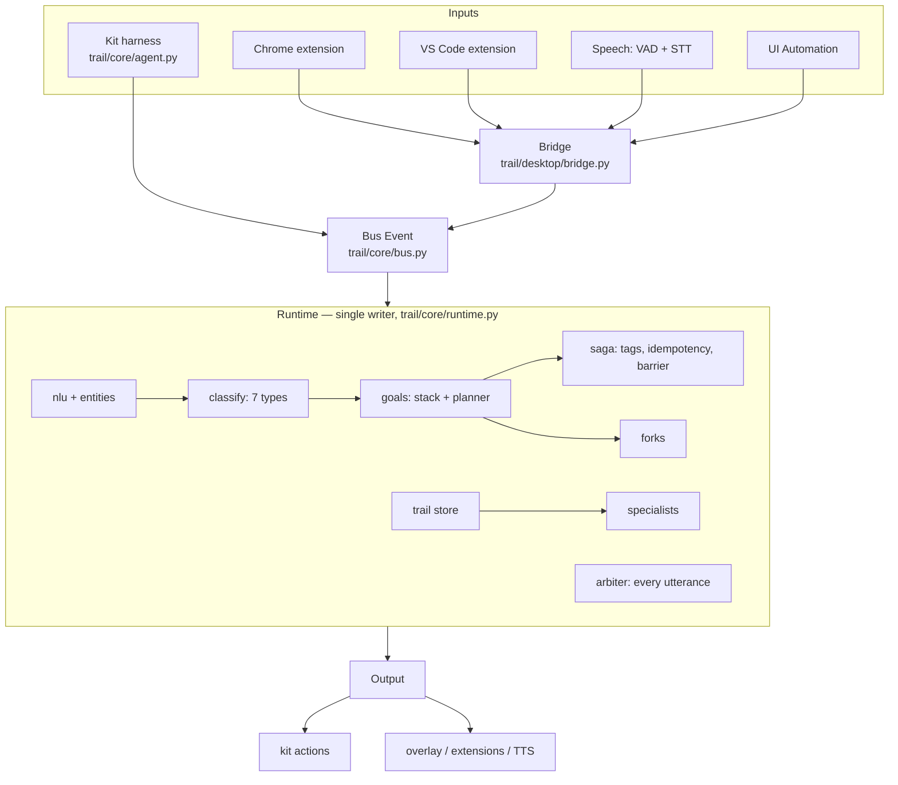

# Architecture

All inputs share one event stream; one runtime decides what to say and when (PDF p. 5-7).

## Invariants

* **Single writer.** Only `Runtime.run()` mutates state. Workers (speech-to-text, vision, model
  routing, forks, timers, desktop tool execution) post `Proposal`s stamped with the epochs they
  depend on (`turn`, `frame`, `audio`, slot epochs); stale proposals are dropped, so stale work never
  reaches the user. Input wins ties over proposals.
* **Duck, then decide.** Any user activity ducks output first (desktop) and is then classified:
  backchannel resumes, correction/addition patches slots, cancel stops and parks, topic switch parks
  or abandons, clarification answers from the checkpoint, pointer shift rebinds "this".
* **Plans are derived, then reconciled.** `goals.plan()` recomputes steps from slots each time;
  `_reconcile` cancels calls whose arguments changed, compensates committed writes that no longer
  match, reuses cached results (checkpoints), and asks when a required argument is missing.
* **The arbiter gates everything spoken.** Filler budget, no verbatim repeats, no completion claim
  before the tool completes; agent-initiated notices wait by tier (critical now, high at a typing
  pause or end of speech, normal at a boundary, low in a digest), are re-checked for staleness just
  before speaking, and count against an unsolicited budget that "not now" tightens.
* **Session-only memory.** Trail, goals, frames and audio buffers live in RAM and are cleared on
  teardown. Sensitive targets are dropped at the source and again in the core.

## Two run modes, one runtime

| | Harness mode (scored) | Desktop mode (demo) |
| --- | --- | --- |
| Adapter | `trail/core/agent.py` (kit queues) | `trail/desktop/bridge.py` (WebSocket) |
| Tools | kit manifest, executed by the harness | `trail/desktop/tools.py` over the Skylark Air corpus |
| Speech out | whole utterances → `filler_speech` / `clarification_request` / `final_response` | streamed tokens, TTS, duck/unduck |
| Speculative tool calls | off (could fail hidden `tool_not_called` checks) | allowed for read-only tools |
| Models | optional: STT, vision, routing fallback | same, plus local reflexes |
